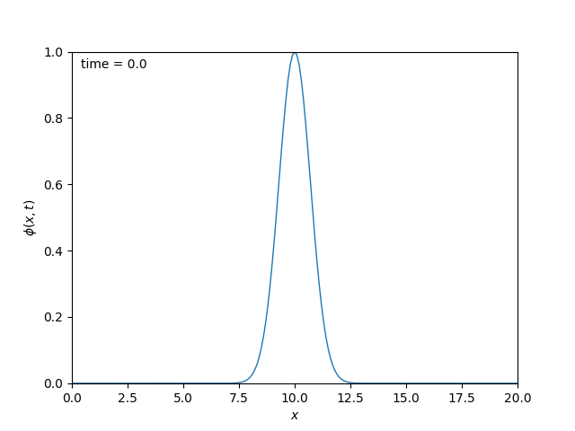

# Numerical Solution to the 1+1 Wave Equation
In this project, we solve for the time evolution of the scalar wave equation in 1 spatial dimension using the Method of Lines (MOL). A fourth-order finite difference method is used to dicretize the spatial derivatives. The equations are then formulated as an ODE problem to be integrated in time with the fourth-order Runge-Kutta method.

